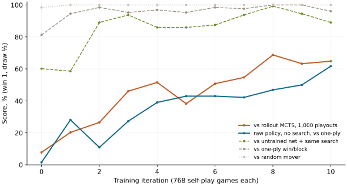

# AlphaZero from scratch on Connect Four

Issue: https://github.com/theoriclabs/letsusecompute/issues/11

Self-play, Monte Carlo tree search and a 374,810-parameter residual network, trained from random weights across two Compute runs. The first run was killed by its timeout after iteration 10; the second resumed from its checkpoint and stopped itself at iteration 34.

## Measured result

Every row is 64 games from the network's side, alternating who moves first. Score counts a win as 1 and a draw as ½. The network always searches 64 simulations per move except in the last row.

| Opponent | Iteration 0 | Iteration 10 | Iteration 34 |
|---|---:|---:|---:|
| Random mover | 63–0–1 (98%) | 64–0–0 | 64–0–0 |
| One-ply heuristic: win if you can, block if you must | 52–0–12 (81%) | 61–1–2 (96%) | 64–0–0 (100%) |
| **Classic MCTS, 1,000 random playouts per move** | **4–2–58 (8%)** | **40–3–21 (65%)** | **60–1–3 (95%)** |
| Untrained network with the same search | 34–9–21 (60%) | 56–2–6 (89%) | 62–2–0 (98%) |
| Raw policy, no search, vs one-ply heuristic | 1–0–63 (2%) | 39–1–24 (62%) | 34–1–29 (54%) |

Won–drawn–lost. The issue asked for two yardsticks, random and one-ply. Both saturate early: 64 simulations of search, even with an untrained network, already find most immediate wins and blocks, so the untrained network beats the one-ply heuristic 81% of the time. The rollout-MCTS row is the useful curve.



The raw policy stalls near 50% against the one-ply heuristic. Without search it misses forced blocks that the heuristic punishes; with search the same network does not.

64 games per point gives roughly ±12 points of noise at mid-range scores. The dip at iteration 12, right after the resume, is inside that; the resumed run restores the optimizer and the replay buffer, so training does not restart.

Weights: [theoriclabs/alphazero-connect4](https://huggingface.co/theoriclabs/alphazero-connect4) (`model.pt`, iteration 34). Full per-iteration history: [`assets/results/history.json`](assets/results/history.json).

## Runs and cost

| Run | What | Billed (incl. boot) | Cost |
|---|---|---:|---:|
| `run_0411032f9c1f4dec867ce57b639ce949` | fresh `train_and_push`, `--timeout 900`: iterations 0–10, then killed | 17 min | $1.00 |
| `run_09f9460d561293e9727117af141f3da5` | `resume_from_hub`: iterations 11–34, stopped by `max_seconds` | 22 min | $1.30 |
| `run_081b9f42fad3142b04ff4cdd216aef44` | sample, 3 small iterations | 6 min | $0.35 |
| three failed starts | worker processes could not start (see below) | 23 min | $1.36 |

**$4.01 total**, all on RunPod H100-SXM. Receipts: [`assets/results/receipts.txt`](assets/results/receipts.txt).

An iteration takes about 75 seconds: 17 s of self-play (768 games, 12 worker processes, 26k positions), 4 s of training, and 54 s of evaluation. Evaluation is most of the bill; the resumed run evaluated every second iteration.

## Checkpoints, timeouts and resume

After every iteration the job overwrites `$COMPUTE_ARTIFACT_DIR/alphazero-c4/checkpoint.pt` (model, optimizer, the last 8 iterations of self-play data, the untrained network, and the history) plus `history.json`. The file is written to a temporary name and renamed, so a kill mid-write cannot corrupt it.

**A run killed by `--timeout` keeps its artifact.** The first run hit its 900-second limit during iteration 11; `compute artifacts list` showed a completed 15.9 MB artifact holding the iteration-10 checkpoint. At most one iteration is lost.

**Handing that artifact to the next run is the gap.** Compute has no option to give a run an earlier run's artifact as input. The script has two ways around it:

1. `resume <run_id>` / `resume_and_push <run_id>`: the job installs the Compute CLI and runs `compute artifacts get` itself. That needs a Compute API key on the machine, stored as the `COMPUTE_API_KEY` secret. It is implemented but was not run here: putting an account-wide key on a rented GPU is a decision for the account owner.
2. `resume_from_hub`: `train_and_push` also uploads each checkpoint to Hugging Face under `checkpoint/`, and this entrypoint continues from there with only the `hf` secret. Download took 0.9 seconds. This is what the published run used.

## Reproduce

```bash
curl -fsSL https://raw.githubusercontent.com/theoriclabs/letsusecompute/main/posts/alphazero-small/train.py -o train.py
curl -fsSL https://compute.cx/install.sh | sh
compute setup
compute run train.py::train --gpu runpod/H100-SXM --dry-run
compute run train.py::train --gpu runpod/H100-SXM --timeout 300 --args '{"sample": true}' --wait
```

Training in two runs, with the Hugging Face copy (set `HUB_REPO` in `train.py` to a repo you own):

```bash
compute secrets set hf
compute run train.py::train_and_push --gpu runpod/H100-SXM --timeout 900 --wait
compute run train.py::resume_from_hub --gpu runpod/H100-SXM --timeout 1500 \
  --args '{"iterations": 40, "max_seconds": 1140, "eval_every": 2}' --wait
```

Or with Compute artifacts only, after storing a revocable API key:

```bash
compute secrets set COMPUTE_API_KEY
compute run train.py::train --gpu runpod/H100-SXM --timeout 900 --wait
compute run train.py::resume --gpu runpod/H100-SXM --timeout 1500 --args '{"run_id": "<first run id>"}' --wait
```

Then `compute runs receipt <run_id>`, `compute artifacts list <run_id>`, and `compute machines`.

## What is trained

- **Game:** Connect Four, 6 rows × 7 columns. Input planes: current player's stones, opponent's stones.
- **Network:** a 64-channel stem, 5 residual blocks, a policy head over 7 columns and a tanh value head. 374,810 parameters.
- **Search:** PUCT with `c_puct = 1.5`. 64 simulations per move in self-play and evaluation. Dirichlet noise (α = 1.0, ε = 0.25) at the root in self-play. Moves are sampled in proportion to visits for the first 8 plies, then the most-visited move is played.
- **Self-play:** 768 games per iteration, split across 12 worker processes. Each worker advances all its games in lock-step and evaluates their leaves in one batch.
- **Training:** 300 AdamW steps per iteration (lr 1e-3, weight decay 1e-4, batch 512) on a sliding window of the last 8 iterations, with random left-right mirroring. Loss is cross-entropy to the visit distribution plus squared error to the game result.
- **Evaluation:** five opponents, 64 games each, as in the table. Rollout MCTS is plain UCT (`c = 1.4`) with uniformly random playouts.

Why not 9×9 or 19×19 Go: Connect Four has 7 moves per turn and games of about 34 plies, so 768 games take 17 seconds. 9×9 Go has ~80 moves per turn and games around 80 plies. At 64 simulations that is roughly 25 times the search work per game, before the larger network each evaluation needs. 19×19 needs orders of magnitude more; AlphaGo Zero used thousands of TPUs for self-play. It is out of scope for one GPU and this budget.

## What went wrong first

Three starts failed before any training, costing $1.36. All three came from running self-play in parallel processes on Compute:

1. **Forked workers:** they could not use CUDA once the parent process had touched it (`Cannot re-initialize CUDA in forked subprocess`). The parent then waited for them until the timeout.
2. **Spawned workers:** they could not import the script. The Compute runner loads `train.py` under a generated module name (`_compute_runner_user_<run>_payload_train_py`) that a fresh process cannot import.
3. **A hung startup:** a version with no startup timeout hung silently for the whole run.

The fix: workers are plain `python train.py --az-worker …` subprocesses talking to the parent over a localhost socket, and the parent checks that they are alive and prints their output if they die. Wrapping `import compute` in `try/except` to help the workers was rejected by the CLI's static entrypoint check before upload.

## Files

- `train.py`: the whole job: game, MCTS, network, workers, training, evaluation, checkpoints, resume, publishing.
- `SKILL.md`: instructions for an agent.
- `plot_results.py`: regenerates `assets/strength-curve.svg` and `assets/training-loss.svg` from `assets/results/history.json`.
- `assets/results/`: the full history and run receipts.

Reference: [alpha-zero-general](https://github.com/suragnair/alpha-zero-general) (MIT) by Surag Nair et al., for structure and Connect Four settings. Method: Silver et al., [Mastering the game of Go without human knowledge](https://www.nature.com/articles/nature24270) (2017) and [A general reinforcement learning algorithm that masters chess, shogi, and Go through self-play](https://www.science.org/doi/10.1126/science.aar6404) (2018).
