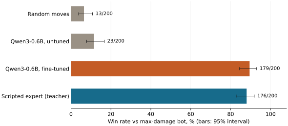
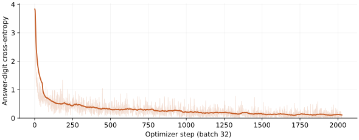

# Teach Qwen to play Pokémon

Issue: https://github.com/theoriclabs/letsusecompute/issues/10

Qwen3-0.6B reads a Pokémon Showdown battle as text and picks a numbered option. Out of the box it wins 23 of 200 random battles against a bot that always clicks its strongest move. After one epoch of LoRA fine-tuning on 65k decisions from a scripted expert, it wins 179 of 200, matching the expert it copied (176/200).

Everything, including the Showdown simulator and its Node runtime, installs and runs inside one Compute job.

## Measured result

Full run: `run_ce31cb05d8113aa66a61e80e5cfcabb0`, RunPod H100-SXM, **$1.78** (30 billed minutes). Sample run `run_2ac74278cd44c30126f7bb337c0831d2`, **$0.29**. **$2.07 total** for the issue. No other runs.

Format `gen9randombattle`. Opponent for every row: poke-env's `MaxBasePowerPlayer`. 200 battles per row, fresh random teams each battle.

| Player | Won | Win rate | 95% interval |
|---|---:|---:|---:|
| Random legal moves | 13/200 | 6.5% | 3.8–10.8% |
| Qwen3-0.6B, untuned | 23/200 | 11.5% | 7.8–16.7% |
| **Qwen3-0.6B, fine-tuned** | **179/200** | **89.5%** | **84.5–93.0%** |
| Scripted expert (teacher, tera off) | 176/200 | 88.0% | 82.8–91.8% |

The fine-tuned model and its teacher are statistically indistinguishable; 200 battles cannot separate 89.5% from 88%. The claim is that the student reached the teacher, not that it surpassed it.

On 1,000 held-out expert decisions the untuned model picks the expert's option 18.0% of the time and the fine-tuned model 96.7%. The saved adapter reproduces 96.7% after reload.

Published adapter: [theoriclabs/qwen3-0.6b-pokemon-showdown](https://huggingface.co/theoriclabs/qwen3-0.6b-pokemon-showdown), revision `25301aa79ca9af784eea6dc14172bc28a04eab84`. Full metrics: [`assets/results/full/results.json`](assets/results/full/results.json).



## Where the time went

| Step | Time |
|---|---:|
| Machine agent connected | 9 s |
| `pip install` of the image (torch, poke-env, transformers, peft) | 86 s |
| Node download, Showdown download, `npm install`, build, server start | 13 s |
| 3,000 expert battles (65,815 decisions) | 105 s |
| Baselines, 200 battles each: random, expert | 17 s |
| Qwen download | 8 s |
| Untuned Qwen, 200 battles (7,399 decisions, batched) | 41 s |
| LoRA SFT, 2,026 steps at batch 32 | 1,103 s |
| Fine-tuned Qwen, 200 battles (4,118 decisions) | 36 s |

The simulator setup the issue worried about took 13 seconds. The job itself ran 23 minutes; training was 80% of it.

The untuned model needed 7,399 decisions for 200 battles, the fine-tuned model 4,118: it wins faster.

## What the model sees

One prompt per decision, built from poke-env's battle object. Moves come first, then switches. Every number is something a human player sees on screen.

```
Pokémon battle (gen9randombattle), turn 13.
Your active: mimikyubusted (Ghost/Fairy), 51% HP. Base Atk 90, SpA 50, Def 80, SpD 105, Spe 96.
Opponent active: greedent (Normal), 95% HP. Base Atk 95, SpA 55, Def 95, SpD 75, Spe 20.
Pokémon left: you 4, opponent 3.
Options:
1. Use shadowsneak: Ghost, physical, power 40 (same type), x0 vs greedent.
2. Use playrough: Fairy, physical, power 90 (same type), x1 vs greedent, 90% accuracy.
3. Use drainpunch: Fighting, physical, power 75, x2 vs greedent.
4. Use swordsdance: Normal, status.
5. Switch to alcremiesaltedcream: Fairy, 100% HP; its types hit greedent x1, greedent's types hit it x1; base Spe 64.
6. Switch to kommoo: Dragon/Fighting, 100% HP; its types hit greedent x2, greedent's types hit it x1; base Spe 85.
7. Switch to slaking: Normal, 100% HP; its types hit greedent x1, greedent's types hit it x1; base Spe 100.
Reply with the number of the best option.
```

The expert answered `3`. The chat template runs with thinking disabled. The player reads the logits at the answer position for digits `1`…`n` and takes the largest; the model never generates free text and cannot pick an illegal option. The untuned and fine-tuned players use the same decoding.

## Reproduce

```bash
curl -fsSL https://raw.githubusercontent.com/theoriclabs/letsusecompute/main/posts/qwen-pokemon/train.py -o train.py
curl -fsSL https://compute.cx/install.sh | sh
compute setup
compute run train.py::train --gpu runpod/H100-SXM --dry-run
compute run train.py::train --gpu runpod/H100-SXM --timeout 1800 --args '{"sample": true}' --wait
```

Sample mode plays 60 expert battles and 20 eval battles per player. On our run it went from 2/20 to 14/20 wins. It proves the pipeline; it is not the result.

The full run:

```bash
compute run train.py::train --gpu runpod/H100-SXM --timeout 3600 --wait
```

Bare `--gpu H100-SXM` is refused at quote time as ambiguous between providers; qualify it. Review the quote before confirming.

To publish the adapter as well, store a Hugging Face token and run `train_and_push`, which attaches `Secret.from_name("hf")`:

```bash
compute secrets set hf
compute run train.py::train_and_push --gpu runpod/H100-SXM --timeout 3600 --wait
```

Then:

```bash
compute runs receipt <run_id>
compute artifacts list <run_id>
compute artifacts get <run_id> <artifact_id> <version> --out ./out
compute machines
```

`--args` also accepts `data_battles`, `eval_battles`, and `epochs`.

## What is trained

- Base `Qwen/Qwen3-0.6B`, revision `c1899de289a04d12100db370d81485cdf75e47ca`, BF16.
- LoRA rank 16, alpha 32, no dropout, on all attention and MLP projections: 10,092,544 trainable parameters.
- Loss: cross-entropy on the single answer digit at the last prompt position. AdamW, learning rate `2e-4`, 50-step warmup then linear decay, batch 32, gradient clip 1.0, one epoch. Longest prompt 566 tokens.
- Data: 3,000 battles by `SimpleHeuristicsPlayer` (poke-env), 60% against `MaxBasePowerPlayer`, 20% against a random player, 20% against itself. Forced single-option turns are dropped. 65,815 decisions; 1,000 held out for agreement, 64,815 trained. 16% of expert choices are switches.
- The expert's terastallization is turned off, so teacher and student play the same action space. Neither Qwen player terastallizes. With tera on, the stock heuristic won 85/100 in a local check, so turning it off did not handicap the teacher.
- Simulator: Pokémon Showdown commit `a5df8274e85b0889bf2a9b3422a08b39732374fc`, Node `v22.22.0`, poke-env 0.16.1, started with `--no-security` on localhost.



## Limits

- Imitation caps the student at its teacher. `SimpleHeuristicsPlayer` is a few dozen lines of rules. Beating a stronger opponent needs a stronger teacher or reinforcement learning on wins; the issue's optional GRPO pass was not run.
- One opponent. We did not test against humans, the Showdown ladder, or other bots.
- The prompt carries type multipliers and base stats that the heuristic also uses. A model that learned to read the rules from raw names would be a different, harder experiment.
- One seed. 200 battles per player; see the intervals.
- Replays and the raw expert decisions were saved as Compute artifacts, but artifact persistence failed at the end of the full run (reported as `rpt_fb1514dac8427ebe3c65bd06baa547a4`), so only `results.json` and the adapter survive, via Hugging Face.

## Files

- `train.py`: complete Compute job: Showdown setup, prompt builder, expert, batched Qwen player, SFT, evaluation, push.
- `SKILL.md`: agent instructions.
- `plot_results.py`: regenerate the SVG figures from `assets/results/full/results.json`.
- `assets/results/`: sample and full `results.json` and receipts.

Credits: [Pokémon Showdown](https://github.com/smogon/pokemon-showdown) (MIT), [poke-env](https://github.com/hsahovic/poke-env) (MIT) and its baseline players, [Qwen3](https://huggingface.co/Qwen/Qwen3-0.6B) (Apache-2.0).
